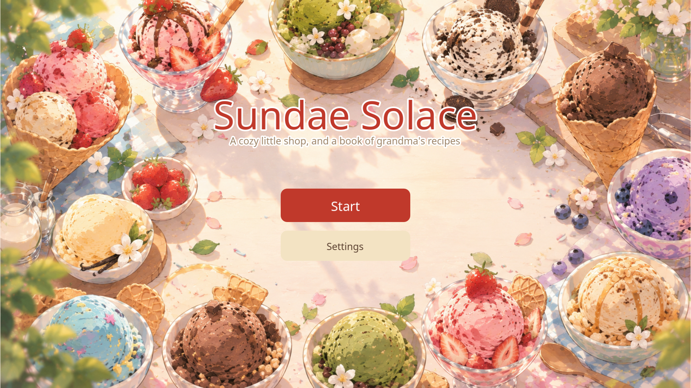
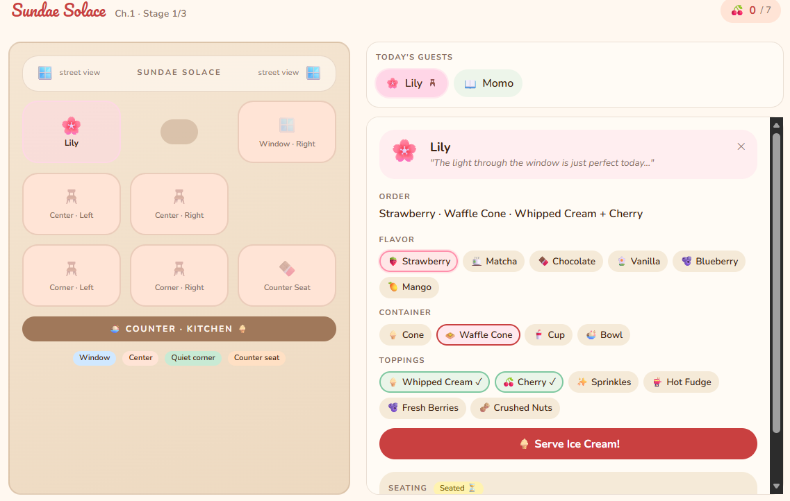

# 🍨 Sundae Solace🍦

> A relaxing ice cream shop simulation game where you learn English by reading between the lines.🍧

**▶️ Play the game:** [https://khunap6.itch.io/sundae-solace-game](https://khunap6.itch.io/sundae-solace-game)

---
## 👥 Team & Roles

| # | Member | Student ID | Professional Role | Responsibilities |
|---|---|---|---|---|
| 1 | Mr. Songwut Khwanmueang | 66312060 | **Technical Writer / Game Guide Designer** | Wrote the "How to Play" game manual |
| 2 | Mr. Chalermchai Buain | 66310974 | **Video Editor** | Edited videos |
| 3 | Mr. Thanapat Thongto | 66312251 | **Video Editor & Gameplay Demonstrator** | Edited videos and demonstrated gameplay |
| 4 | Mr. Chayutphong Phumtup | 66311148 | **Documentation Specialist** | Prepared project documentation |
| 5 | Mr. Khunanon Phayaknoi | 66310691 | **Lead Game Developer** | Built the entire game in Godot (100%); assembled characters, items, and the shop |
| 6 | Mr. Ratchaphiphat Thichon | 66315498 | **Project Manager / Presenter / Video Producer** | Produced videos, provided project updates, and pitched the game idea |
| 7 | Ms. Kanlayanee Ratsameethong | 66310462 | **Game Designer & QA Tester** | Developed the game concept; tested gameplay, UI, and game correctness |
| 8 | Ms. Chanapha Artdon | 66311070 | **Narrative Designer / Art Director / Voice Producer** | Wrote the story and character dialogue; created character voices (Luvvoice); defined the game's theme, color palette, and visual style; wrote prompts for scenes and videos |

---
## 📖 About

**Sundae Solace** is a cozy simulation / puzzle / casual game in which you run a small ice cream shop. Each customer speaks in English, and you must read their words, work out how they feel and what they need, and then make decisions in the game: **where to seat them** and **which ice cream to serve**.

| | |
|---|---|
| **Genre** | Cozy Simulation / Puzzle / Casual |
| **Target learners** | Ages 12–22 (lower-secondary through early university) with basic English, or anyone who wants to practice beginner English |
| **Language goals** | Reading comprehension and everyday vocabulary through context |
| **Engine** | Godot |

---

## 🎮 How to Play

1. Take the customer's order.
2. Choose the seat that best suits the customer.
3. Choose the ice cream flavor to serve.
4. Read the feedback, then welcome the next guest. Each shift has **6 guests**.

### 🔁 Core Loop

`Input → Understand → Action → Feedback → Reward → Next Guest`

| Step | What happens |
|---|---|
| **1. Input** (read / listen) | The customer states their needs in English. Read the dialogue, or press **Listen again** to hear it once more. |
| **2. Understand** | Pick out the key words and interpret the customer's feelings. If you're stuck, press **Translate to Thai** — but it costs **10 points**. |
| **3. Action** | Choose the right seat and the right ice cream flavor. |
| **4. Feedback** (results screen) | See whether your seat and flavor were right or wrong. **Grandma's note** explains which words in the sentence led to the answer, and the original sentence is shown next to its Thai translation for review. |
| **5. Reward** | Earn points for accuracy: **+50** for the correct seat, **+50** for the correct flavor, and a **+20 bonus** if you understood without using the translation. The guest reacts with joy ("The guest is beaming!"). |
| **6. Next Guest** | A new customer arrives with new needs. Repeat until all 6 guests are served. |

---

## 📚 English Skills Practiced

1. **Reading for main ideas** – Read a customer's dialogue and summarize what they need.
   *Example:* Sam: "I just want somewhere quiet to rest." → choose the **Quiet Corner**.
2. **Emotion and feeling vocabulary** (*tired, stressed, freezing, focused*) and **surroundings vocabulary** (*view, plants, warm, quiet*).
3. **Guessing idioms and expressions from context**, e.g. *about to die* (almost gone), *thaw out* (warm up), *calm down* (become calm).
4. **Keyword spotting** – Connect key words in a sentence to the correct decision.

---

## 📸 Screenshots

<!--Put your in-game screenshots in docs/screenshots/ and replace the placeholders below.
Example:  -->

  

---

## 🎬 Gameplay Demo Video

<!--
Option 1 (recommended): upload the video to YouTube and link it with a clickable thumbnail:

Option 2: link to a video file stored in the repo:
[▶️ Watch the gameplay demo](docs/videos/gameplay-demo.mp4)
-->

<!---->

**▶️ Watch on YouTube:** [video on YouTube](https://youtu.be/iPRLP1TQQD8?t=14&si=Idz3EnpyRA29QjpR)

---

## 🖼️ Prototype

**🔗 Prototype link:** [Figma Make](https://www.figma.com/make/OQDVfWP7sY8BocHTOvcWo4/Create-Sundae-Solace-Game?code-node-id=0-9&p=f&fullscreen=1)

<!-- Add more prototype screens here, e.g.  -->

---

## 🤖 AI Tools Used

| Tool | Used for |
|---|---|
| **Figma Make** | Designing the game UI and building the prototype |
| **Gemini** | Generating characters, items, videos, and cutscenes, using prompts written by the team to match the game's theme, color palette, and visual style |
| **Claude** | Assisting with code for the game, built in Godot |
| **Luvvoice** | Generating character voices (text-to-speech) from the English dialogue |
| **ChatGPT** | Helping write the characters' dialogue, and generating background images for the game scenes |
